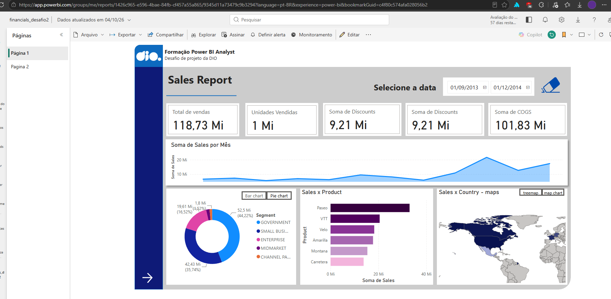
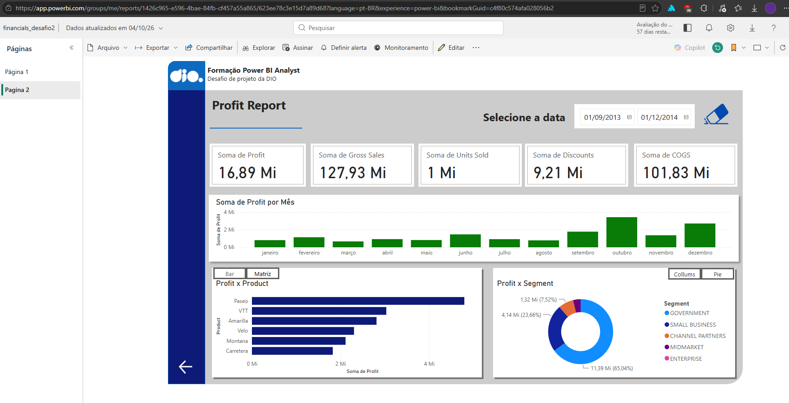

# Relatório de Vendas e Lucro | Power BI (Desafio DIO)

Projeto prático da formação **Power BI Analyst** da DIO. O objetivo foi criar um relatório interativo e bem estruturado a partir da base **financials** (sample financials do Power BI), com navegação entre páginas, segmentadores, botões e indicadores para alternar visuais sobre o mesmo assunto.

## Sobre o projeto

O relatório tem duas páginas com o mesmo layout (cabeçalho, menu lateral, seletor de datas e navegação):

- **Página 1: Sales Report.** Visão de vendas.
- **Página 2: Profit Report.** Visão de lucro, criada de forma autoral, com outro ângulo de análise.

## Páginas

### Página 1: Sales Report

- Cartões: total de vendas, unidades vendidas, discounts e COGS
- Gráfico de área: soma de Sales por mês
- Sales x Segment, com botões para alternar entre **barras** e **pizza (rosca)**
- Sales x Product (gráfico de barras)
- Sales x Country, com botões para alternar entre **treemap** e **mapa**



### Página 2: Profit Report

- Cartões: Profit, Gross Sales, Units Sold, Discounts e COGS
- Gráfico de colunas: soma de Profit por mês (ordenado de janeiro a dezembro com Month Number)
- Profit x Product, com botões para alternar entre **gráfico de barras** e **matriz**
- Profit x Segment, com botões para alternar entre **colunas empilhadas** (por faixa de desconto) e **rosca**



## Recursos utilizados

- **Estrutura definida:** cabeçalho, menu lateral e área dos visuais, com formas, imagens e caixas de texto
- **Botões de navegação** entre as páginas
- **Segmentador de datas** sincronizado entre as páginas, com botão para limpar o filtro
- **Botões e indicadores (bookmarks)** para alternar visuais sobre o mesmo assunto
- **Visuais:** cartões, gráficos de área, colunas, barras, colunas empilhadas, rosca/pizza, treemap, mapa e matriz
- **Painel de seleção** para organizar e renomear os visuais
- **Publicação** no Power BI Service

## Base de dados

A base **financials** vem do repositório do curso: [julianazanelatto/power_bi_analyst](https://github.com/julianazanelatto/power_bi_analyst).

Principais campos usados: Sales, Gross Sales, Profit, COGS, Discounts, Units Sold, Product, Segment, Country, Discount Band, Date, Month Name e Month Number.

## Relatório publicado

Link no Power BI Service: **(https://app.powerbi.com/links/wGMIfRZ-cY?ctid=d4ec4886-9883-4925-b319-4815977a4245&pbi_source=linkShare)**

> Observação: o acesso ao link pode depender da conta usada na publicação. Por isso, os prints das páginas estão incluídos no repositório.

## Estrutura do repositório

```
.
├── README.md
├── financials_desafio2.pbix
└── imagens/
    ├── pagina1.png
    └── pagina2.png
```

## Como abrir o projeto

1. Baixe o arquivo `financials_desafio2.pbix`.
2. Abra no **Power BI Desktop** (Windows).
3. Use os botões do relatório para navegar entre as páginas e alternar os visuais.

## Aprendizados

- Organização de layout e padronização visual entre páginas
- Uso de indicadores combinados com botões para trocar visuais no mesmo espaço
- Sincronização de segmentadores entre páginas
- Ordenação de colunas por outro campo (Month Name por Month Number)
- Publicação e teste de relatórios no Power BI Service

## Autoria

Projeto desenvolvido por **Felipe Bandeira** como parte do desafio da DIO.
